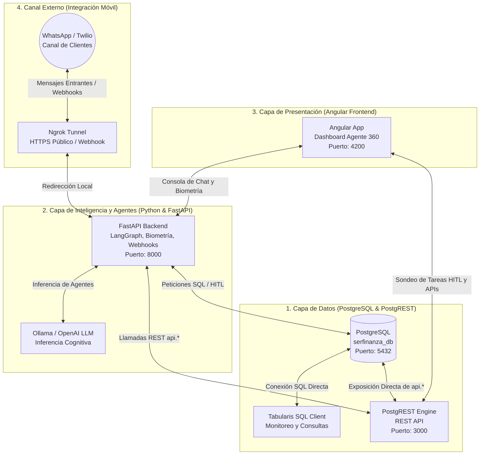

# 🏢 Manual Operativo y Lista de Tareas: Despliegue de Servicios Serfinanza Agente 360

Esta guía interactiva en formato **Markdown** proporciona un conjunto detallado de instrucciones paso a paso y listas de tareas (checklists) para iniciar, configurar y validar cada uno de los servicios que integran el ecosistema del dashboard **Agente 360 Fintech** de Banco Serfinanza.

---

## 📐 Arquitectura de Conectividad de los Servicios

El siguiente diagrama detalla la interconexión y puertos asignados a cada servicio en el entorno local:



---

## 🛠️ Panel de Prerrequisitos del Sistema

Antes de iniciar el despliegue, asegúrate de cumplir con los siguientes componentes en tu sistema Linux:

- [x] **PostgreSQL 14+** instalado y ejecutándose en el puerto estándar `5432`.
- [x] **Node.js (v18 o superior)** y **npm** configurados globalmente.
- [x] **Python 3.10+** y `pip` instalados.
- [x] **Ollama** configurado localmente (o en su defecto, acceso a internet para interactuar con la API de OpenAI configurada en `.env`).
- [x] **ngrok** (opcional, necesario únicamente si deseas recibir mensajes reales de WhatsApp a través de los webhooks de Twilio o WhatChimp).

---

# 🚀 Guía de Despliegue Paso a Paso

---

## 1. Configuración de la Base de Datos PostgreSQL
La base de datos centraliza toda la información de los clientes, transacciones, ofertas y la cola de aprobaciones de tareas HITL (Human-in-the-Loop).

### 📋 Lista de Tareas
- [ ] Verificar que el servicio de PostgreSQL está activo.
- [ ] Crear la base de datos `serfinanza_db`.
- [ ] Ejecutar el script DDL y de carga de datos sintéticos principales (`backend/serfinanza_db_setup.sql`).
- [ ] Ejecutar los scripts adicionales de datos históricos de banca y retail (opcional, para simulaciones complejas).

### 💻 Comandos de Consola

1. **Verificar el estado del servicio PostgreSQL:**
   ```bash
   sudo systemctl status postgresql
   ```
   *(Si no está activo, inícialo con `sudo systemctl start postgresql`)*.

2. **Crear la base de datos `serfinanza_db`:**
   ```bash
   # Conectarse a la consola de postgres e instanciar la base de datos
   psql -U postgres -c "CREATE DATABASE serfinanza_db;"
   ```
   *(Usa la contraseña `postgres` o la correspondiente a tu perfil local)*.

3. **Ejecutar el Setup de la Base de Datos Sandbox:**
   ```bash
   # Cargar el esquema 'api' con las tablas y datos semilla desde la carpeta 'backend/'
   psql -U postgres -d serfinanza_db -f backend/serfinanza_db_setup.sql
   ```

4. **(Opcional) Cargar las filas del Simulador Completo:**
   Si deseas utilizar los datos históricos masivos del banco y los tickets de Olímpica en la base de datos pública:
   ```bash
   psql -U postgres -d serfinanza_db -f db/banco/01_serfinanza_ddl_supabase.sql
   psql -U postgres -d serfinanza_db -f db/banco/clientes_rows.sql
   psql -U postgres -d serfinanza_db -f db/banco/productos_rows.sql
   psql -U postgres -d serfinanza_db -f db/banco/cdt_detalle_rows.sql
   psql -U postgres -d serfinanza_db -f db/banco/tarjetas_detalle_rows.sql
   psql -U postgres -d serfinanza_db -f db/banco/transacciones_rows.sql
   ```

> [!TIP]
> **Administración Visual:** Puedes abrir la herramienta **Tabularis** en tu escritorio, crear una nueva conexión con los credenciales `host: localhost`, `port: 5432`, `database: serfinanza_db`, `user: postgres`, `password: postgres` y explorar visualmente las tablas del esquema `api` y `public`.

---

## 2. Lanzamiento del Servidor API PostgREST
PostgREST lee automáticamente el esquema de tu base de datos y genera una API REST instantánea y de alto rendimiento en el puerto `3000`.

### 📋 Lista de Tareas
- [ ] Verificar los parámetros en `backend/postgrest.conf`.
- [ ] Dar permisos de ejecución al binario de PostgREST.
- [ ] Iniciar el servidor en segundo plano.
- [ ] Validar la conexión consumiendo el endpoint de tareas HITL.

### 💻 Comandos de Consola

1. **Dar permisos de ejecución al ejecutable de PostgREST (si es necesario):**
   ```bash
   chmod +x backend/postgrest
   ```

2. **Ejecutar PostgREST apuntando a la configuración:**
   ```bash
   # Desde el directorio raíz del proyecto
   ./backend/postgrest backend/postgrest.conf > backend/postgrest.log 2>&1 &
   ```
   *(Este comando inicia el servidor en segundo plano y redirige la salida a `backend/postgrest.log`)*.

3. **Validar que el servicio responde correctamente:**
   ```bash
   # Consultar los clientes registrados en la base de datos mediante la API REST de PostgREST
   curl http://127.0.0.1:3000/clientes
   ```
   *(Debería responder un arreglo JSON conteniendo la información de María Amparo, Carlos, Roberto, etc.)*.

---

## 3. Despliegue del Servidor de Backend de Agentes (FastAPI)
El backend implementa el núcleo cognitivo basado en LangGraph, gestiona las sesiones de chat, el sistema invisible de biometría del comportamiento y procesa los webhooks de mensajería.

### 📋 Lista de Tareas
- [ ] Crear y activar el entorno virtual de Python.
- [ ] Instalar las dependencias listadas en `backend/requirements.txt`.
- [ ] Verificar y asegurar las claves y variables en `backend/.env`.
- [ ] Levantar el servidor de desarrollo FastAPI usando Uvicorn (Puerto `8000`).

### 💻 Comandos de Consola

1. **Navegar al directorio de backend y configurar el entorno virtual:**
   ```bash
   cd backend
   # Crear entorno virtual (si no se ha creado previamente)
   python3 -m venv venv
   # Activar el entorno virtual
   source venv/bin/activate
   ```

2. **Instalar dependencias requeridas:**
   ```bash
   pip install --upgrade pip
   pip install -r requirements.txt
   ```

3. **Validar archivo de entorno `.env`:**
   Asegúrate de que el archivo `/home/openclaw/Documentos/antigra/serfinanza/backend/.env` tiene la clave de OpenAI (o configuración de Ollama correspondiente) y los datos de conexión a la base de datos:
   ```env
   OPENAI_API_KEY=tu-api-key-aqui
   OPENAI_MODEL_NAME=gpt-4o-mini
   DB_NAME=serfinanza_db
   ```

4. **Lanzar el servidor FastAPI:**
   ```bash
   python3 run.py
   ```
   *(El backend estará disponible y escuchando peticiones en `http://localhost:8000`)*.

5. **Prueba rápida de salud (Health Check):**
   ```bash
   curl http://localhost:8000/health
   ```
   *(Debe retornar `{"status": "healthy", "database_mode": "postgres", ...}`)*.

---

## 4. Lanzamiento del Frontend Angular (Agente 360)
La interfaz de usuario construida en Angular se conecta tanto a PostgREST (puerto `3000` para sondeo de datos HITL) como al backend FastAPI (puerto `8000` para orquestación de agentes en tiempo real).

### 📋 Lista de Tareas
- [ ] Instalar los módulos de Node.js necesarios en el proyecto raíz.
- [ ] Validar la compilación del proyecto.
- [ ] Iniciar el servidor local de desarrollo de Angular (Puerto `4200`).
- [ ] Abrir el navegador e interactuar con la plataforma.

### 💻 Comandos de Consola

1. **Asegurar la instalación de dependencias del frontend (desde la raíz del proyecto):**
   ```bash
   # Abre una nueva pestaña de terminal en la raíz del proyecto
   npm install
   ```

2. **Iniciar el servidor de desarrollo de Angular:**
   ```bash
   npm start
   ```
   *o directamente:*
   ```bash
   npx ng serve
   ```

3. **Acceder a la aplicación:**
   Abre tu navegador de preferencia y dirígete a:
   👉 **[http://localhost:4200](http://localhost:4200)**

---

## 5. (Opcional) Canal de WhatsApp & Webhooks vía Ngrok
Si deseas realizar pruebas reales enviando mensajes desde un teléfono móvil usando Twilio o WhatChimp, es necesario abrir un túnel seguro con ngrok para que la nube pueda alcanzar tu servidor FastAPI local.

### 📋 Lista de Tareas
- [ ] Iniciar un túnel ngrok apuntando al puerto del backend (`8000`).
- [ ] Copiar la URL pública generada por ngrok (`https://XXXX.ngrok-free.app`).
- [ ] Configurar el Webhook en la consola de Twilio Sandbox o en WhatChimp con la ruta `/api/webhooks/twilio` o `/api/webhooks/whatsapp`.

### 💻 Comandos de Consola

1. **Iniciar el túnel ngrok:**
   ```bash
   ngrok http 8000
   ```

2. **Vincular el Webhook:**
   * **Para Twilio:** Configura la URL de mensaje entrante (Incoming Message Webhook) en la consola de Twilio como:
     `https://TU_SUBDOMINIO_NGROK.ngrok-free.app/api/webhooks/twilio` (Tipo de petición: **POST**).
   * **Para WhatChimp:** Configura la URL correspondiente en el panel administrativo de tu integrador de WhatsApp.

---

# 🛑 Comandos de Apagado y Mantenimiento de Servicios

Cuando termines tu sesión de desarrollo o desees reiniciar los servicios desde cero, utiliza el siguiente manual rápido:

### 1. Detener el Frontend Angular
En la terminal donde se ejecuta `npm start` / `ng serve`, presiona:
```text
Ctrl + C
```

### 2. Detener el Backend FastAPI
En la terminal donde se ejecuta `python3 run.py`, presiona:
```text
Ctrl + C
```

### 3. Apagar el Servidor API PostgREST
Para finalizar el proceso de PostgREST que corre en segundo plano:
```bash
pkill postgrest
```

### 4. Limpiar e inicializar la Base de Datos de cero
Si deseas purgar las transacciones y re-sembrar los perfiles iniciales limpios:
```bash
psql -U postgres -d serfinanza_db -c "DROP SCHEMA IF EXISTS api CASCADE; CREATE SCHEMA api;"
psql -U postgres -d serfinanza_db -f backend/serfinanza_db_setup.sql
```

---

> [!NOTE]
> **Tolerancia a fallos:** El frontend de Angular cuenta con un mecanismo de respaldo automático. Si por alguna razón detienes PostgREST o la base de datos PostgreSQL, la UI cargará datos simulados del Mock local automáticamente para garantizar que no haya interrupción del flujo visual, mostrando advertencias de conectividad de forma silenciosa en la consola.
