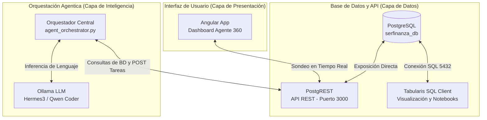

# 🏢 Guía de Orquestación y Sandbox de Agentes Serfinanza

Este sandbox integra una base de datos local en PostgreSQL, un servidor de APIs REST automáticas con PostgREST, y una orquestación multi-agente impulsada por modelos LLM locales en Ollama. Toda la actividad se sincroniza en tiempo real con el frontend de Angular del dashboard **Agente 360 Fintech**.

---

## 📐 Arquitectura del Sistema

El siguiente diagrama ilustra cómo interactúan todos los componentes del ecosistema local:



---

## 🚀 Componentes Creados e Integrados

1. **Base de Datos Sintética (`serfinanza_db`)**:
   - Tablas creadas en el esquema `api`: `clientes`, `cuentas`, `tarjetas`, `transacciones`, `ofertas`, `tareas_hitl`.
   - Se han cargado perfiles idénticos a los del simulador: María Amparo Gutiérrez, Carlos Herrera Díaz, Roberto Gómez Oñate, etc., con historiales de transacciones de Tiendas Olímpica, SAO y droguerías.
2. **Servidor PostgREST**:
   - Servidor API autogenerado que corre sobre la base de datos local.
   - Configurado en el puerto `3000`. Expone operaciones seguras mediante el rol `web_anon`.
3. **Orquestador Multi-Agente (`agent_orchestrator.py`)**:
   - **Agente Investigador de BD**: Formula peticiones HTTP estructuradas a PostgREST para consolidar la ficha financiera completa de un cliente.
   - **Agente Analista de Ofertas y Riesgo**: Ejecuta una auditoría cognitiva (en Ollama) y diseña la mejor acción (aumento de cupo, tasa excepcional, campaña).
   - **Agente Creador de Tareas HITL**: Estructura la propuesta y la inyecta automáticamente en PostgreSQL a través de PostgREST.
4. **Sincronización en el Frontend (Angular)**:
   - Modificado `MockDataService` para consultar de forma proactiva cada 5 segundos `/tareas_hitl` en PostgREST.
   - Cuando apruebas o rechazas una tarea en la consola del Dashboard, se envía un `PATCH` automático a la base de datos real para actualizar el estado del registro.

---

## 🛠️ Guía de Uso Paso a Paso

### 1. Iniciar y Detener PostgREST

El servidor PostgREST ya está corriendo en segundo plano. Si necesitas verificar logs o reiniciarlo, usa los siguientes comandos en la terminal de la carpeta `backend`:

*   **Verificar logs del servidor**:
    ```bash
    tail -n 20 postgrest.log
    ```
*   **Iniciar el servidor manualmente**:
    ```bash
    ./postgrest postgrest.conf > postgrest.log 2>&1 &
    ```
*   **Detener el servidor**:
    ```bash
    pkill postgrest
    ```

---

### 2. Conectar Tabularis a `serfinanza_db`

**Tabularis** es un cliente SQL avanzado en Rust/Tauri que ya tienes ejecutándose en local. Para visualizar y realizar consultas sobre esta base de datos sintética:

1.  Abre la aplicación **Tabularis**.
2.  Crea una nueva conexión con los siguientes parámetros:
    *   **Motor (Dialect)**: `PostgreSQL`
    *   **Host**: `localhost`
    *   **Puerto**: `5432`
    *   **Base de datos**: `serfinanza_db`
    *   **Usuario**: `postgres`
    *   **Contraseña**: `postgres`
3.  Haz clic en **Connect**.
4.  Podrás explorar las tablas en el esquema `api`, abrir SQL Notebooks para analizar las transacciones de los clientes e incluso habilitar el **asistente de IA (MCP)** integrado en Tabularis.

---

### 3. Ejecutar la Consola Interactiva de Agentes

Puedes iniciar la orquestación cognitiva en cualquier momento ejecutando el script interactivo en la terminal:

```bash
python3 agent_orchestrator.py
```

#### Flujo de Ejecución Visual en Consola:
1.  Te mostrará un listado interactivo con los clientes disponibles.
2.  Selecciona un número (por ejemplo, **2** para Carlos o **4** para Roberto).
3.  Verás la telemetría en tiempo real:
    *   `🔎 Agente Investigador` buscando información de transacciones y saldos.
    *   `📊 Agente Analista` razonando (con Ollama) sobre por qué se justifica un aumento de cupo o CDT.
    *   `📝 Agente HITL` escribiendo directamente la tarea en la base de datos local PostgreSQL a través del puerto 3000.
4.  **¡Efecto Wow!**: Si tienes la pestaña de tu aplicación Angular abierta en el Dashboard de control de agentes, verás aparecer la nueva tarea en la lista de pendientes **de forma automática en menos de 5 segundos**.

---

## 📂 Estructura de Archivos del Backend

Los archivos están ubicados en la ruta del proyecto `/home/openclaw/Documentos/antigra/serfinanza/backend/`:

| Archivo | Propósito |
| :--- | :--- |
| `serfinanza_db_setup.sql` | Esquema de base de datos e inserción de datos sintéticos (PostgreSQL). |
| `postgrest.conf` | Archivo de parámetros de conexión y mapeo de PostgREST. |
| `postgrest` | Ejecutable binario estático de PostgREST para Linux. |
| `postgrest.log` | Registro de actividad y solicitudes del servidor REST. |
| `agent_orchestrator.py` | Script en Python que implementa los agentes interactivos y la interfaz CLI. |
| `agent_orchestration_guide.md` | Esta guía explicativa de arquitectura. |

---

> [!NOTE]
> La orquestación y sincronización en tiempo real están diseñadas con tolerancia a fallos. Si detienes PostgREST o la base de datos de PostgreSQL, el frontend de Angular volverá a utilizar el simulador local de forma transparente sin bloquear la experiencia de usuario.
